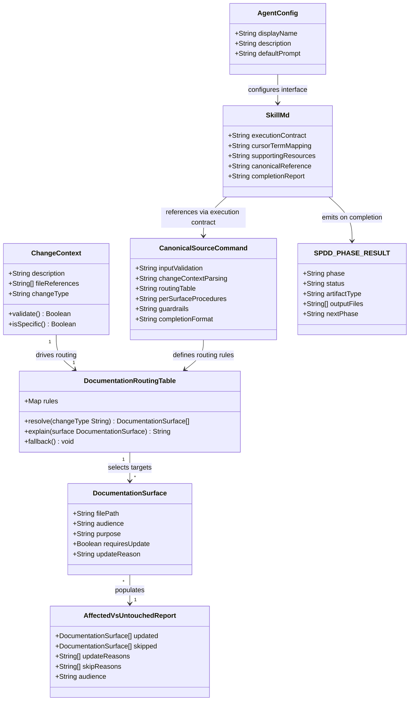

# Add `spdd-doc-sync` Skill

## Requirements

Implement a standalone documentation-sync maintenance skill (`spdd-doc-sync`) that gives maintainers a repeatable, precision-first way to update human-facing in-repo documentation after any workflow, skill, or behavior change. The skill determines which documentation surfaces are genuinely affected, updates only those, explains each decision, and leaves unrelated documentation untouched.

The skill must operate as a distinct maintenance phase separate from `spdd-sync`, which owns prompt truth. It must never modify files under `spdd/prompt/`, must not fabricate changelog entries for nonexistent behavior changes, must not assign version numbers, and must prefer narrow justified edits over broad rewrites. Every documentation change it makes must be traceable to a real behavior change described in the user-supplied change context.

Scope in: in-repo documentation surfaces — `docs/skills/index.md`, `docs/skills/<skill>.md`, `docs/getting-started.md`, `docs/first-feature.md`, `docs/next-steps.md`, `docs/index.md`, `docs/maintainer-notes.md`, `docs/.vitepress/config.mjs`, `CHANGELOG.md`, `README.md`, `plugins/specark/CLAUDE.md`.

Scope out: publishing the docs site, creating release tags, modifying canonical source command files unless the underlying workflow contract truly changed, external documentation systems outside the repository.

---

## Entities

---

## Approach

1. Structural pattern:
   - Follow the `spdd-sync` structural pattern exactly: a canonical source command at `plugins/specark/references/source-commands/spdd-doc-sync.md` contains all behavioral logic; a thin `SKILL.md` wrapper at `plugins/specark/skills/spdd-doc-sync/SKILL.md` enforces the execution contract; `agents/openai.yaml` provides interface configuration
   - The canonical source command is the sole authoritative definition of input validation, routing logic, per-surface update procedures, guardrails, and completion format
   - The `SKILL.md` wrapper delegates entirely to the canonical command and never re-specifies behavior

2. Input interface:
   - Accept free-form change description as the primary input, with optional `@file` references as enrichment context
   - Validate that the description is specific enough to drive routing before proceeding; if too vague, use `AskUserQuestion` to clarify
   - If the change context implies the prompt is stale, surface this and ask the user to run `spdd-sync` first; do not proceed to documentation updates that depend on prompt accuracy

3. Documentation routing:
   - Use an explicit routing table (not freeform reasoning) to map change-context types to documentation surface targets, ensuring predictable and auditable targeting
   - Three primary change types with defined surface lists:
     - Skill addition → `docs/skills/index.md`, `docs/skills/<skill>.md`, `docs/.vitepress/config.mjs`, `plugins/specark/CLAUDE.md`, and optionally `CHANGELOG.md`
     - Behavior change → affected `docs/skills/<skill>.md`, optionally `docs/getting-started.md` or `docs/first-feature.md`, and `CHANGELOG.md` entry
     - Workflow change → `docs/getting-started.md`, `docs/first-feature.md`, or `docs/maintainer-notes.md` based on audience; optionally `CHANGELOG.md`
   - For change types that do not fit a defined category, stop and ask before routing rather than defaulting to a broad update

4. Completion signal:
   - Emit `SPDD_PHASE_RESULT` with `artifact_type: docs` and `next_phase: complete`
   - This is a terminal maintenance step; it is not part of the orchestrator's forward workflow sequence

---

## Structure

### Deliverable File Set

1. `plugins/specark/references/source-commands/spdd-doc-sync.md` — canonical source command (created)
2. `plugins/specark/skills/spdd-doc-sync/SKILL.md` — thin wrapper (created)
3. `plugins/specark/skills/spdd-doc-sync/agents/openai.yaml` — agent interface config (created)
4. `docs/skills/spdd-doc-sync.md` — user-facing skill documentation page (created)
5. `docs/skills/index.md` — skills discovery table (updated: new row)
6. `docs/.vitepress/config.mjs` — navigation config (updated: new `skills` array entry after `spdd-sync`)
7. `plugins/specark/CLAUDE.md` — skills reference table (updated: new row)

### Component Relationships

1. `CanonicalSourceCommand` is the authoritative behavioral definition; `SkillMd` enforces the execution contract that delegates entirely to it
2. `CanonicalSourceCommand` defines the `DocumentationRoutingTable` rules that determine which `DocumentationSurface` targets are selected for a given `ChangeContext`
3. `AgentConfig` configures the interface (display name, description, default prompt); it does not affect skill logic
4. `spdd-doc-sync` is a maintenance skill: invoked standalone after any cycle that produces user-visible behavior changes; not sequenced by `spdd-orchestrator` in the forward workflow
5. Boundary: `spdd-doc-sync` writes only to documentation surfaces; `spdd-sync` writes only to `spdd/prompt/`; these boundaries are mutually exclusive and must not overlap

### Layered Responsibilities

1. Interface layer — `agents/openai.yaml` and `SKILL.md` wrapper: receive invocation, enforce execution contract, delegate to canonical source command
2. Routing layer — `DocumentationRoutingTable` in the canonical source command: parse change context, apply change-type rules, select target surfaces
3. Update layer — per-surface update procedures in the canonical source command: execute targeted edits to each matched surface, apply audience split, follow CHANGELOG format rules
4. Reporting layer — `AffectedVsUntouchedReport` in the canonical source command: record all decisions (updated and skipped) with reasons, emit `SPDD_PHASE_RESULT`

---

## Operations

### Task 1: Create canonical source command — `plugins/specark/references/source-commands/spdd-doc-sync.md`

1. Responsibility: authoritative behavioral definition for all skill logic; satisfies the 11-section quality bar from `high-quality-skill-authoring.md`
2. Required sections and their content:
   - Purpose and trigger conditions: invoked after any workflow, skill, or behavior change to update in-repo human-facing documentation; not for prompt maintenance (owned by `spdd-sync`); not for publishing or external documentation
   - Scope and non-goals: in-repo docs only; no `spdd/prompt/` access; no external documentation systems; no version number assignment; no speculative or cosmetic edits
   - Required startup reads: `plugins/specark/references/orchestrator-contract.md` (for SPDD_PHASE_RESULT format); the current content of each documentation surface targeted by this invocation (read before editing)
   - Execution contract: validate input → check prompt-stale condition → parse change context → apply routing table → read each target surface → execute updates → produce AffectedVsUntouchedReport → emit SPDD_PHASE_RESULT
   - Repository term mapping: `ChangeContext` (user-supplied description), `DocumentationSurface` (target file path with audience label), `DocumentationRoutingTable` (change-type-to-surface decision rules), `AffectedVsUntouchedReport` (structured update/skip decision log)
   - Workflow/operating loop: the skill runs in a single invocation; it does not produce intermediate artifacts or iterate; it reads all target surfaces before writing any
   - Decision rules and heuristics — the routing table:
     - Skill addition: always update `docs/skills/index.md` (new table row), `docs/skills/<skill>.md` (new page), `docs/.vitepress/config.mjs` (new skills array entry after `spdd-sync` for maintenance skills), `plugins/specark/CLAUDE.md` (new skills table row); propose a `CHANGELOG.md` `### Added` entry and ask user to confirm before writing
     - Behavior change: update the relevant `docs/skills/<skill>.md` page; update `docs/getting-started.md` or `docs/first-feature.md` if the invocation or artifact flow changed; propose a `CHANGELOG.md` `### Changed` entry and ask user to confirm before writing
     - Workflow change: update `docs/getting-started.md`, `docs/first-feature.md`, or `docs/maintainer-notes.md` based on whether the change is user-facing or maintainer-facing; propose a `CHANGELOG.md` entry and ask user to confirm
     - Unrecognized change type: ask the user which surfaces to target before proceeding; do not default to broad update
   - Artifact and file conventions: all documentation edits are direct in-place file updates; CHANGELOG entries follow `## [version] — [date] — [title]` / `### Added | Changed | Fixed | Notes` structure with no version number assigned by the skill; VitePress config skills array entries are inserted after `spdd-sync` for maintenance skills
   - Validation/completion contract: every updated file must have a traceable reason tied to the change context; every skipped file must have an explicit "not updated because" reason; the AffectedVsUntouchedReport must cover every documentation surface in the defined set, not only those that were changed
   - Stop conditions and failure handling: stop if change context is too vague to route; stop if change context implies prompt is stale; stop if a skill referenced in the change context does not match any existing file paths; do not silently fill in gaps
   - Output/reporting expectations: AffectedVsUntouchedReport with file paths, audiences, and reasons; SPDD_PHASE_RESULT with `phase: spdd-doc-sync`, `artifact_type: docs`, `next_phase: complete`

### Task 2: Create `plugins/specark/skills/spdd-doc-sync/SKILL.md`

1. Responsibility: thin execution contract wrapper that enforces delegation to the canonical source command; mirrors `spdd-sync/SKILL.md` structure exactly
2. Frontmatter fields:
   - `name`: `spdd-doc-sync`
   - `description`: Keep in-repo human-facing documentation aligned with current behavior and workflow changes using the canonical repository workflow text integrated into this project
   - `disable-model-invocation`: `true`
3. Required Execution Contract section — three rules:
   - Rule 1: Read `../../references/source-commands/spdd-doc-sync.md` completely every time the skill runs
   - Rule 2: Follow the canonical command text exactly; do not summarize, shorten, skip, reinterpret, or partially apply any step, guardrail, output format, naming rule, or follow-up message
   - Rule 3: If the canonical command text conflicts with this wrapper, the canonical command text wins
4. Cursor Term Mapping section: `AskUserQuestion tool` → ask the user directly with a concise question only when the canonical command explicitly requires it; `Read tool` → read referenced files directly from the repository; `@file` or `@folder` → repository-relative paths supplied by the user or discovered in the repository; `Save` or `write file` → create or update files in this repository at the required paths; References to other `/spdd-*` commands → use the corresponding local SPDD skill
5. Supporting Resources section: `../../references/source-commands/SOURCES.md` for provenance only; `../../references/orchestrator-contract.md` for the shared phase result block; `../../references/high-quality-skill-authoring.md` for skill-authoring quality bar
6. Canonical Reference section: `../../references/source-commands/spdd-doc-sync.md`
7. Required Completion Report section — the exact SPDD_PHASE_RESULT block with:
   - `phase: spdd-doc-sync`
   - `status: completed|blocked`
   - `artifact_type: docs`
   - `output_files:` listing each file updated
   - `next_phase: complete`
   - `review_recommended: yes`
   - `summary:` single-line summary

### Task 3: Create `plugins/specark/skills/spdd-doc-sync/agents/openai.yaml`

1. Responsibility: agent interface configuration; mirrors structure from other skills in `plugins/specark/skills/`
2. Fields:
   - `name`: `spdd-doc-sync`
   - `description`: Keep human-facing repository documentation aligned with current behavior and workflow changes
   - `defaultPrompt`: an opening message that prompts the user to describe what changed in the repository (skill added, behavior modified, workflow updated) and optionally reference a story, analysis, or changelog entry using `@`

### Task 4: Create `docs/skills/spdd-doc-sync.md`

1. Responsibility: dedicated user-facing skill documentation page; follows `docs/skills/spdd-sync.md` format
2. Sections:
   - Opening line: single-sentence summary — "`spdd-doc-sync` keeps in-repo human-facing documentation aligned after workflow, skill, or behavior changes."
   - Quick start: invocation example using a free-form change description or `@` reference
   - "Use it when" list: a new skill is added; a skill's behavior or interface changed; an onboarding or workflow step changed; maintainer notes need updating; a CHANGELOG entry is needed after a behavior change
   - "Do not use it for" list: syncing the structured prompt (use `spdd-sync` for that); publishing the docs site or creating release tags; external documentation outside this repository
   - Output section: lists the types of files the skill updates; notes that the skill produces an affected-vs-untouched report explaining each decision
   - Role in the workflow section: a diagram showing its standalone maintenance position, not part of the forward sequence
   - Info callout: explain the boundary with `spdd-sync` — `spdd-doc-sync` updates human-facing docs; `spdd-sync` updates the structured prompt; they are complementary but distinct

### Task 5: Update `docs/skills/index.md`

1. Responsibility: add a new row and subsection for `spdd-doc-sync` in the skills discovery page
2. Approach: add a "Maintenance" subsection (or extend the existing table if it includes maintenance skills) with:

   | Skill | Input | Output location | Use when |
   |---|---|---|---|
   | [spdd-doc-sync](/skills/spdd-doc-sync) | Change description or `@` reference | `docs/`, `README.md`, `CHANGELOG.md`, `plugins/specark/CLAUDE.md` | In-repo docs need updating after a behavior or skill change |

3. Position the new row after `spdd-sync` in the table; if the table uses a phase-skill grouping, consider adding a "Maintenance" header before `spdd-sync` and `spdd-doc-sync` together

### Task 6: Update `docs/.vitepress/config.mjs`

1. Responsibility: insert new skills array entry so the VitePress navigation sidebar includes `spdd-doc-sync`
2. Insertion point: after the `{ text: "spdd-sync", link: "/skills/spdd-sync" }` entry and before the `{ text: "spdd-api-test", link: "/skills/spdd-api-test" }` entry, maintaining the maintenance skill grouping
3. New entry:
   - `text`: `spdd-doc-sync`
   - `link`: `/skills/spdd-doc-sync`

### Task 7: Update `plugins/specark/CLAUDE.md`

1. Responsibility: add `spdd-doc-sync` to the skills reference table so the plugin overview reflects the full skill set
2. New row to insert after the `spdd-sync` row:
   - Skill column: `` `spdd-doc-sync` ``
   - Invocation column: `` `/specark:spdd-doc-sync` ``
   - Purpose column: `Sync human-facing in-repo documentation with current behavior and workflow changes`

---

## Norms

1. SKILL.md wrapper pattern: every skill under `plugins/specark/skills/` uses `disable-model-invocation: true`; the `Required Execution Contract` section uses exactly three rules pointing to the canonical source command and stating the canonical command wins on conflict; do not add behavioral logic to the wrapper
2. Canonical source command completeness: must satisfy all 11 sections from `plugins/specark/references/high-quality-skill-authoring.md`; the quality test is: if an agent opens only the `SKILL.md` and the files it names, it must be able to perform the task with high confidence and low interpretation drift; vague instructions such as "handle this appropriately" without decision criteria are a failure
3. Traceability norm: every documentation change must include a reason tied to the change context; "updated for clarity" without a real behavioral change driving it is not acceptable; the AffectedVsUntouchedReport must cover all surfaces in the defined set, not only those that were modified
4. CHANGELOG format fidelity: entries follow `## [version] — [date] — [title]` at the section level with `### Added`, `### Changed`, `### Fixed`, or `### Notes` subsections; no version number is assigned by the skill — use `[Unreleased]` or ask the user which version applies
5. Documentation audience split: `docs/getting-started.md`, `docs/skills/*.md`, `docs/first-feature.md`, `docs/next-steps.md`, and `README.md` are user-facing; `docs/maintainer-notes.md` and `CHANGELOG.md` are maintainer-facing; the AffectedVsUntouchedReport must label each changed file's audience
6. VitePress config ordering: new `skills` array entries must respect logical grouping; maintenance skills (`spdd-sync`, `spdd-doc-sync`) belong together; do not append entries randomly at the end of the array

---

## Safeguards

1. Boundary rule: `spdd-doc-sync` must not read or write any file under `spdd/prompt/`; that boundary is exclusively owned by `spdd-sync`; if an invocation attempts to cross this boundary, stop immediately and explain the constraint
2. Stale-prompt guard: if the change context describes implementation changes not yet reflected in the prompt artifact, stop and inform the user: "The change you described may require updating the structured prompt first. Run `spdd-sync` on the affected prompt before making documentation claims that depend on prompt accuracy."
3. Traceability rule: every documentation update must be traceable to a stated behavioral change in the change context; if the change context is too vague to produce a traceable reason for a specific surface, stop and ask for clarification before editing that surface
4. Restraint rule: the routing table must affirmatively match the change type to a surface before any edit is made; when a change type does not fit a defined routing category, ask the user which surfaces to target rather than defaulting to a broad update
5. Fabrication rule: must not add CHANGELOG entries for behavior changes that did not occur; CHANGELOG content must match the stated change context exactly and must not embellish or generalize
6. No version assignment: may propose and write CHANGELOG entries but must not assign version numbers; use `[Unreleased]` as the version placeholder or ask the user which version to use
7. Skill-page-rename guard: if the change context implies a skill was renamed, detect both the old and new page names and surface the ambiguity explicitly rather than silently creating a new page while leaving the old one in place
8. Multiple-change handling: if the change context describes several distinct changes, handle them together in one invocation but report separately in the AffectedVsUntouchedReport which documentation files were updated for which change
9. Input specificity gate: before applying the routing table, validate that the change context is specific enough to produce traceable update reasons; a description of "things changed" or "docs need updating" without identifying what changed is not sufficient to proceed
