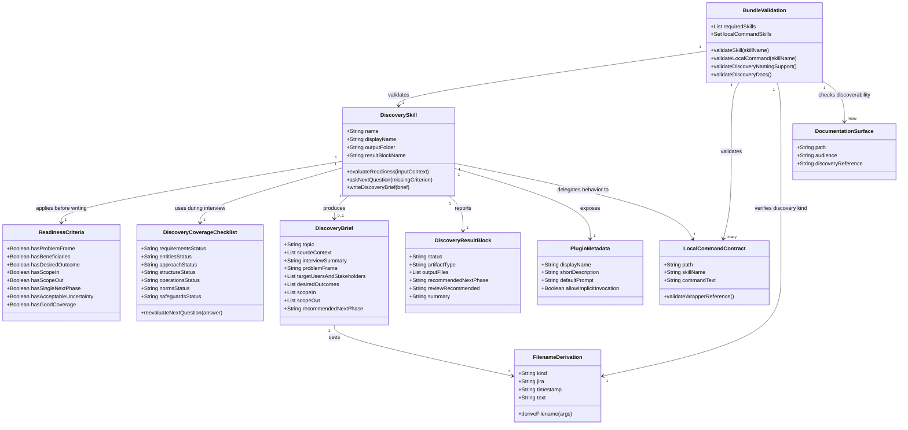

# Add spdd-discovery Discovery Interview Skill

## Requirements
Implement a standalone `spdd-discovery` Discovery Interview skill that turns rough ideas, noisy notes, pasted context, or repository-backed discovery inputs into a durable Discovery Brief before planning, story splitting, or technical analysis begins.

The change must preserve SpecArk's explicit, file-backed phase model: discovery is manually invoked, writes exactly one `spdd/discovery/` artifact when complete, emits a parseable `SPDD_DISCOVERY_RESULT` block, and recommends exactly one next phase from `spdd-plan`, `spdd-story`, or `spdd-analysis`. It must not alter orchestrator start-phase detection, generate stories, produce analysis artifacts, generate REASONS prompts, implement code, or route into downstream skills automatically.

The implementation must fit existing repository conventions for slim skill wrappers, local command contracts, skill metadata, filename derivation, bundle validation, and user-facing documentation. Public naming must consistently use `spdd-discovery`, "Discovery Interview", and "Discovery Brief".

## Entities

Core business entities are the Discovery Interview workflow, the Discovery Brief artifact, the REASONS-informed Discovery Coverage Checklist used to guide the interview, the readiness criteria used to decide whether the interview has good coverage, the discovery-specific result block, and the repository surfaces that expose and validate the new skill. The implemented pattern uses slim `SKILL.md` wrappers over command files: copied upstream commands remain under `references/source-commands/`, while SpecArk-authored commands such as discovery, planning, and orchestration live under `references/local-commands/`.

## Approach
1. Skill design:
   - Create `plugins/specark/skills/spdd-discovery/SKILL.md` as a slim local command wrapper that reads `../../references/local-commands/spdd-discovery.md`.
   - Create `plugins/specark/references/local-commands/spdd-discovery.md` for the full Discovery Interview command contract.
   - Define trigger conditions, scope and non-goals, required startup reads, execution contract, repository term mapping, interview loop, REASONS-informed coverage checklist, readiness criteria, artifact rules, validation rules, blocked behavior, and output reporting in the local command file.
   - Include required startup reads for `../../references/high-quality-skill-authoring.md`, `../../references/orchestrator-contract.md`, `../spdd-plan/SKILL.md`, `../spdd-story/SKILL.md`, and `../spdd-analysis/SKILL.md` inside the local command file.
   - Make `../../scripts/derive_spdd_filename.py` the required filename source for discovery artifacts.
   - Refactor existing SpecArk-authored `spdd-plan` and `spdd-orchestrator` behavior into `references/local-commands/` and leave their `SKILL.md` files as slim wrappers.

2. Artifact contract:
   - Add `spdd/discovery/.gitkeep` so the project-local artifact folder is visible before any Discovery Brief is produced.
   - Extend `plugins/specark/scripts/derive_spdd_filename.py` with a `discovery` kind that emits `<jira>-<timestamp>-[Discovery]-<slug>.md` and accepts the existing `--text`, `--jira`, and `--timestamp` inputs.
   - Require completed Discovery Briefs to include the exact sections: Source Context, Interview Summary, Problem Frame, Target Users And Stakeholders, Desired Outcomes, Scope In, Scope Out, Workflow And User Journey, Domain Concepts And Terms, Constraints And Policies, Data, Integrations, And Repository Touchpoints, Risks And Assumptions, Open Questions, Recommended Next Phase, and Evidence Log.

3. Validation and metadata:
   - Add `spdd-discovery` to the plugin validation inventory as a packaged local command skill so it is not checked as an upstream source-command wrapper and is not implicitly treated as an orchestrator-routable phase.
   - Add explicit validator checks for the discovery skill files, `SPDD_DISCOVERY_RESULT`, `spdd/discovery/`, docs exposure, and discovery filename helper support.
   - Add `plugins/specark/skills/spdd-discovery/agents/openai.yaml` with implicit invocation disabled, display name "SPDD Discovery Interview", a valid hex brand color, a 25-64 character short description, and a default prompt containing `$spdd-discovery`.

4. Documentation:
   - Add `docs/skills/spdd-discovery.md` with quick start, use cases, non-goals, output contract, manual invocation status, and workflow placement.
   - Update `docs/skills/index.md`, `docs/.vitepress/config.mjs`, `docs/workflow/index.md`, `docs/workflow/phase-handoffs.md`, `README.md`, and `plugins/specark/CLAUDE.md` so users can find the skill and understand that discovery is manually invoked until a separate orchestrator story lands.
   - Update related onboarding or installation tables only where they list the complete skill set or first-command routing. Do not overstate orchestrator support.

5. Packaging consistency:
   - Refresh plugin manifest descriptions and default prompt examples when they describe the supported workflow or enumerate visible entry points.
   - Keep existing skill behavior intact while moving SpecArk-authored command text into `references/local-commands/`. Do not edit upstream canonical source command files, orchestrator routing rules, or downstream phase result contracts for this story.

## Structure

### Inheritance Relationships
1. `spdd-discovery` follows the slim local command wrapper pattern now used by `spdd-plan` and `spdd-orchestrator`.
2. `spdd-discovery` does not inherit from the upstream canonical phase wrapper pattern that reads `references/source-commands/<skill>.md`.
3. Discovery Briefs are upstream handoff artifacts analogous to planning artifacts but with a distinct artifact type and output folder.
4. `SPDD_DISCOVERY_RESULT` is a discovery-specific result block and does not replace the standard `SPDD_PHASE_RESULT` block used by existing orchestrated phases.

### Dependencies
1. `plugins/specark/skills/spdd-discovery/SKILL.md` depends on `plugins/specark/references/local-commands/spdd-discovery.md` for the complete local command contract.
2. `plugins/specark/references/local-commands/spdd-discovery.md` depends on local references for authoring standards, orchestration boundaries, adjacent downstream skill behavior, and REASONS terminology.
3. `plugins/specark/references/local-commands/spdd-discovery.md` depends on `plugins/specark/scripts/derive_spdd_filename.py` for deterministic Discovery Brief names.
4. `plugins/specark/scripts/validate_plugin_bundle.py` depends on skill wrappers, local command files, metadata, docs, and filename helper support to validate the new workflow surface.
5. `docs/.vitepress/config.mjs` depends on a new docs page existing at `docs/skills/spdd-discovery.md`.
6. `README.md`, `docs/skills/index.md`, `docs/workflow/index.md`, `docs/workflow/phase-handoffs.md`, and `plugins/specark/CLAUDE.md` depend on consistent public names and artifact paths.

### Layered Architecture
1. Skill Layer: `plugins/specark/skills/spdd-discovery/` defines a slim wrapper, metadata, repository term mapping, and the local command reference.
2. Local Command Layer: `plugins/specark/references/local-commands/spdd-discovery.md` defines runtime behavior, interview rules, coverage checklist, artifact rules, and completion reporting. Existing local `spdd-plan` and `spdd-orchestrator` behavior also lives under `references/local-commands/`.
3. Utility Layer: `plugins/specark/scripts/derive_spdd_filename.py` derives `discovery` artifact filenames using the existing helper API shape.
4. Validation Layer: `plugins/specark/scripts/validate_plugin_bundle.py` enforces skill inventory, local command wrapper classification, discovery docs, result block, and filename support.
5. Documentation Layer: `docs/`, `README.md`, and `plugins/specark/CLAUDE.md` expose how to invoke the Discovery Interview and where Discovery Briefs are written.
6. Artifact Layer: `spdd/discovery/` stores user-project Discovery Briefs and preserves the file-backed handoff to `spdd-plan`, `spdd-story`, or `spdd-analysis`.

## Operations

### Create Skill Directory and Local Command - spdd-discovery
1. Responsibility: Add the standalone Discovery Interview skill wrapper under `plugins/specark/skills/spdd-discovery/` and its full local command contract under `plugins/specark/references/local-commands/`.
2. Files:
   - `plugins/specark/skills/spdd-discovery/SKILL.md`
   - `plugins/specark/skills/spdd-discovery/agents/openai.yaml`
   - `plugins/specark/references/local-commands/spdd-discovery.md`
3. `SKILL.md` content requirements:
   - Frontmatter includes `name: spdd-discovery`, a trigger-oriented description, and `disable-model-invocation: true`.
   - Opening purpose states that the skill turns rough ideas, noisy notes, pasted context, and referenced files into a Discovery Brief.
   - Required execution contract says to read `../../references/local-commands/spdd-discovery.md` completely every time and follow it exactly.
   - Repository term mapping defines AskUserQuestion, Read, `@file`, Save/write file, and references to other `spdd-*` skills.
   - Supporting resources list the local command file and `../../scripts/derive_spdd_filename.py`.
   - Required completion report delegates to the exact `SPDD_DISCOVERY_RESULT` block in the local command reference.
4. `plugins/specark/references/local-commands/spdd-discovery.md` content requirements:
   - Scope section says the skill consolidates discovery input, validates source references, asks one question at a time to help the user navigate and polish the idea, writes a Discovery Brief, and recommends one next phase.
   - Non-goals section forbids story generation, technical analysis artifacts, REASONS Canvas prompts, implementation code, tests, source requirement updates, Context Review Interview behavior, and orchestrator routing changes.
   - Required startup reads list `../../references/high-quality-skill-authoring.md`, `../../references/orchestrator-contract.md`, `../spdd-plan/SKILL.md`, `../spdd-story/SKILL.md`, and `../spdd-analysis/SKILL.md`.
   - Execution contract says this is a repository-native local command wrapper, treats the user's initial prompt as a starting hypothesis, requires at least one focused interview question before writing any Discovery Brief, and blocks when required startup reads are missing.
   - Repository term mapping defines `spdd/discovery/`, Discovery Brief, referenced paths, free-text context, interview answers, and valid downstream phases.
   - Interview loop states that the skill validates context, builds and shows a concise Discovery Coverage Checklist, asks one focused question, re-evaluates the checklist after every relevant answer, asks the highest-value next question, offers to write when there is good coverage, and writes only after the user explicitly says `generate now`.
   - Discovery Coverage Checklist uses REASONS dimensions: Requirements, Entities, Approach, Structure, Operations, Norms, and Safeguards. Each line is marked `strong`, `partial`, or `open`, and the checklist is a status artifact rather than a multi-question worksheet.
   - Readiness criteria require good coverage of the problem or opportunity, beneficiaries, desired outcome, scope in, scope out, recommended downstream phase, acceptable remaining uncertainty, and a polished problem frame that improves on the initial prompt.
   - Source handling requires every referenced file to be read completely, missing files to block or ask for replacement, and conflicts on scope, users, artifact location, or routing to be clarified before writing.
   - Artifact conventions require `../../scripts/derive_spdd_filename.py` with `kind=discovery`, output folder `spdd/discovery/`, repository-relative paths, and a concise slug.
   - Validation rules require the written brief to include all required sections and exactly one recommended next phase from `spdd-plan`, `spdd-story`, or `spdd-analysis`.
   - Stop conditions include unreadable referenced files, wrong artifact inputs, contradictory sources, user pause, inability to recommend exactly one next phase, or insufficient high-impact context after the interview has tried to gather it.
   - No-input handling asks exactly one starter question for a rough idea, pasted notes, or a file reference; it must not immediately block unless the user cannot or will not provide any discovery context.
   - Output expectations define a parseable `SPDD_DISCOVERY_RESULT` block with `status`, `artifact_type`, `output_files`, `recommended_next_phase`, `review_recommended`, and `summary`, and state that blocked runs use no output file and no recommended next phase.
5. `agents/openai.yaml` content requirements:
   - Display name is "SPDD Discovery Interview".
   - Short description is between 25 and 64 characters and names Discovery Brief creation.
   - Brand color is a valid six-character hex value.
   - Default prompt explicitly contains `$spdd-discovery`.
   - Policy sets `allow_implicit_invocation: false`.
6. Existing local command wrapper normalization:
   - Move existing `spdd-plan` and `spdd-orchestrator` command bodies into `plugins/specark/references/local-commands/spdd-plan.md` and `plugins/specark/references/local-commands/spdd-orchestrator.md`.
   - Replace their installed `SKILL.md` files with slim wrappers that read and follow the corresponding local command file.
   - Keep upstream canonical wrappers such as `spdd-story`, `spdd-analysis`, and `spdd-generate` pointing to `references/source-commands/`.

### Extend Filename Helper - Discovery Kind
1. Responsibility: Support deterministic Discovery Brief filenames through the existing helper script.
2. File: `plugins/specark/scripts/derive_spdd_filename.py`.
3. Changes:
   - Add `discovery` to the argparse kind choices.
   - In `derive_filename(args)`, add a branch for `args.kind == "discovery"` that returns `<jira>-<timestamp>-[Discovery]-<slug>.md`.
   - Reuse the existing timestamp, `slugify`, and `--jira` behavior. Do not add a second filename implementation inside the skill.
4. Verification:
   - Running the helper with `discovery`, `--jira SPECARK`, `--timestamp 202605161200`, and text "discovery interview workflow" returns `SPECARK-202605161200-[Discovery]-discovery-interview-workflow.md`.
   - Existing `analysis`, `plan`, `prompt`, `story`, and `test` outputs remain unchanged.

### Add Discovery Artifact Folder
1. Responsibility: Reserve the project-local folder where Discovery Briefs are written.
2. File: `spdd/discovery/.gitkeep`.
3. Constraints:
   - Do not add a sample Discovery Brief unless the implementation also documents that it is an example. The story only requires the folder to exist.
   - Keep the folder project-local and consistent with `spdd/plan/`, `spdd/analysis/`, and `spdd/prompt/`.

### Extend Bundle Validation - Skill, Docs, and Naming
1. Responsibility: Make validation recognize `spdd-discovery` and fail when required discovery surfaces drift.
2. File: `plugins/specark/scripts/validate_plugin_bundle.py`.
3. Changes:
   - Add `spdd-discovery` to the validator's packaged skill inventory without making the orchestrator require `../spdd-discovery/SKILL.md` during startup reads for this story.
   - Introduce `LOCAL_COMMANDS_ROOT` and `LOCAL_COMMAND_SKILLS` for `spdd-orchestrator`, `spdd-discovery`, and `spdd-plan`, keeping canonical source-command checks and standard `SPDD_PHASE_RESULT` checks off for local command skills where appropriate.
   - If the existing `REQUIRED_SKILLS` list continues to drive both package validation and orchestrator skill-reference validation, split the validation data structures into `PACKAGED_SKILLS` and `ORCHESTRATOR_STARTUP_SKILLS` so discovery can be required as a packaged skill while remaining outside orchestrator start-phase detection and required startup references.
   - Add local command validation. It must verify that local command wrappers reference `../../references/local-commands/<skill>.md` and that each local command file exists.
   - Add discovery-specific validation inside `validate_local_command` or a dedicated helper. It must verify that the local command references the authoring guide, orchestrator contract, `spdd-plan`, `spdd-story`, `spdd-analysis`, `derive_spdd_filename.py`, `SPDD_DISCOVERY_RESULT`, `spdd/discovery/`, and "Discovery Brief".
   - Add a helper such as `validate_discovery_naming_support()` that verifies `derive_spdd_filename.py` includes `"discovery"` and emits `[Discovery]`.
   - Add a helper such as `validate_discovery_docs()` that verifies `docs/skills/spdd-discovery.md` exists, `docs/skills/index.md` mentions `spdd-discovery`, `docs/.vitepress/config.mjs` includes the skill link, and either `README.md` or `docs/workflow/index.md` mentions `spdd/discovery/`.
   - Call the discovery validation helpers from `main()`.
4. Constraints:
   - Keep existing validation for `spdd-plan` and canonical phase skills intact.
   - Keep `plugins/specark/skills/spdd-orchestrator/SKILL.md` and `plugins/specark/references/orchestrator-contract.md` free of discovery start-phase rules in this story.
   - Preserve the existing short-description, brand-color, default-prompt, and explicit-invocation metadata checks.
   - Do not weaken or remove checks to make the new skill pass.

### Create Public Skill Documentation
1. Responsibility: Add a user-facing docs page for the Discovery Interview.
2. File: `docs/skills/spdd-discovery.md`.
3. Required sections:
   - Page title `# spdd-discovery`.
   - One-paragraph explanation that `spdd-discovery` is a Discovery Interview for early, unclear, or noisy product context.
   - Explanation that the interview is the point of the skill, that it asks one focused question at a time, and that the user can say `generate now` when context is good enough.
   - Quick start examples for Codex and Claude Code invocation.
   - "Use it when" bullets for vague ideas, mixed notes, early product context, missing scope boundaries, and pre-planning clarification.
   - "Do not use it when" bullets for already-focused stories, existing analysis artifacts, prompt updates, code sync, or implementation.
   - Output section naming `spdd/discovery/`, Discovery Brief, required result block, and exactly one recommended next phase.
   - Interview checklist section explaining the REASONS-informed Requirements, Entities, Approach, Structure, Operations, Norms, and Safeguards coverage checklist.
   - Workflow placement showing `spdd-discovery` before `spdd-plan`, `spdd-story`, or `spdd-analysis`.
   - Info note that the skill is manually invoked and that automatic orchestrator discovery support is a separate follow-up.
4. Constraints:
   - Use "Discovery Interview" and "Discovery Brief" as the polished public labels.
   - Do not expose "Interrogatory LLM" as the user-facing workflow name.

### Update Skill Index and Navigation
1. Responsibility: Make the new docs page discoverable.
2. Files:
   - `docs/skills/index.md`
   - `docs/.vitepress/config.mjs`
3. Changes:
   - Update the skill count text to include the Discovery Interview skill.
   - Add a Discovery or Pre-planning section before Planning, or add `spdd-discovery` near `spdd-plan` with a clear distinction between discovery and planning.
   - Add `spdd-discovery` to the sidebar skills array before `spdd-plan`.
   - Preserve existing controller, phase, maintenance, and pre-flight sections.
4. Constraints:
   - Do not imply the orchestrator enters discovery automatically.
   - Keep the existing table style and docs tone.

### Update Workflow and Top-Level Docs
1. Responsibility: Reflect discovery as a manual pre-workflow intake step without changing the standard orchestrator sequence.
2. Files:
   - `docs/workflow/index.md`
   - `docs/workflow/phase-handoffs.md`
   - `README.md`
   - `plugins/specark/CLAUDE.md`
   - `docs/plugin-layout.md`
   - `docs/references/index.md`
   - `docs/maintainer-notes.md`
   - `docs/contributing.md`
   - `docs/getting-started.md` and installation pages only where they list the complete skill set or first-start routing.
3. Changes:
   - Add `spdd-discovery` as an optional manual step before `spdd-plan`, `spdd-story`, or `spdd-analysis` for vague or incomplete product context.
   - Add `spdd/discovery/` to expected artifact folders.
   - Add `spdd-discovery` to included skills and Claude invocation tables.
   - Update normal workflow diagrams so discovery is shown as optional and manually invoked, not as the orchestrator's default first phase.
   - Update "pick the right first command" guidance so a rough idea with missing problem, user, outcome, or scope context routes to `spdd-discovery`.
   - Update phase-handoff docs to explain that `SPDD_DISCOVERY_RESULT` is a standalone discovery handoff block outside the standard `SPDD_PHASE_RESULT` contract until orchestrator discovery support lands.
   - Document the two command-file locations: `references/source-commands/` for copied upstream originals and `references/local-commands/` for SpecArk-authored local command contracts.
   - Update maintainer and contribution guidance to keep `SKILL.md` files slim and put command behavior in command reference files.
4. Constraints:
   - Do not edit orchestrator start-phase detection in `plugins/specark/skills/spdd-orchestrator/SKILL.md`.
   - Do not claim `with-discovery` controls exist.

### Refresh Plugin Metadata Where User-Facing
1. Responsibility: Keep plugin descriptions from becoming stale after adding discovery.
2. Files:
   - `plugins/specark/.codex-plugin/plugin.json`
   - `plugins/specark/.claude-plugin/plugin.json`
3. Changes:
   - Update descriptions that currently enumerate story creation, analysis, prompt generation, implementation, prompt updates, sync, and documentation sync so they include discovery intake where concise.
   - Add a default prompt example for `$spdd-discovery` if the Codex manifest's default prompt list remains an entrypoint list.
4. Constraints:
   - Preserve valid JSON.
   - Do not change marketplace policy, category, source, or plugin name.

### Verification Tasks
1. Run the filename helper for `discovery` and confirm the expected `[Discovery]` filename.
2. Run `python3 plugins/specark/scripts/validate_plugin_bundle.py` and fix any structural failures.
3. Search for public names and verify consistency:
   - `spdd-discovery`
   - `Discovery Interview`
   - `Discovery Brief`
   - `spdd/discovery/`
4. Search for accidental scope creep:
   - No `with-discovery` controls added.
   - No orchestrator start-phase detection edits that route automatically to discovery.
   - No orchestrator startup-read requirement added for `../spdd-discovery/SKILL.md`.
   - No new canonical source-command file for `spdd-discovery`.
   - No story, analysis, prompt, implementation, or test artifact generated by the discovery skill itself.
5. Manually inspect representative skill behavior from the written `SKILL.md`:
   - A rough one-sentence idea shows a concise Discovery Coverage Checklist and asks exactly one focused question.
   - No input asks exactly one starter question for rough context instead of blocking immediately.
   - Complete brief-like input still enters the interview rather than writing immediately.
   - After every relevant user answer, the skill re-evaluates checklist status before choosing the next question.
   - When the context has good coverage, the skill tells the user they can say `generate now`.
   - `generate now` writes a Discovery Brief only when essentials are sufficient to avoid fabrication.
   - Conflicting source context asks one clarification question or blocks before writing.
   - Blocked discovery reports no output file and no recommended next phase.
6. Run docs build if the repository's usual docs verification is available.

## Norms
1. Skill authoring:
   - Callable `SKILL.md` files must stay slim and point to authoritative command files.
   - Copied upstream originals belong under `plugins/specark/references/source-commands/`.
   - SpecArk-authored command contracts belong under `plugins/specark/references/local-commands/`.
   - Local command files must be operationally complete and use direct instructions that an agent can execute without guessing.
   - Required startup reads must be exact repository-relative paths.
   - Scope and non-goals must be explicit enough to keep discovery separate from planning, story generation, analysis, prompt generation, implementation, and test generation.
2. Invocation policy:
   - `spdd-discovery` must be explicitly invoked.
   - `agents/openai.yaml` must set `allow_implicit_invocation: false`.
   - Docs must show manual invocation examples and must not claim orchestrator support that is out of scope.
3. Artifact discipline:
   - Discovery Briefs belong only under `spdd/discovery/`.
   - File paths in skill output and result blocks must be repository-relative.
   - Completed runs must recommend exactly one next phase. Ambiguous routing requires a clarifying question or blocked outcome.
4. Interview behavior:
   - Ask one focused question at a time.
   - Build and display a concise REASONS-informed Discovery Coverage Checklist before asking the next question.
   - Mark coverage lines as `strong`, `partial`, or `open`.
   - Re-evaluate the best next question after every relevant user answer instead of following a fixed script.
   - Prefer questions that resolve problem framing, user value, scope boundaries, or downstream routing.
   - Avoid implementation-detail questions that belong in `spdd-analysis`, `spdd-reasons-canvas`, or `spdd-generate`.
   - Preserve confirmed user answers separately from model inferences in the Discovery Brief.
   - Tell the user they can say `generate now` when good coverage is reached.
5. Validation:
   - Add checks rather than weakening existing checks.
   - Treat `spdd-discovery` as a local command skill in validation.
   - Keep canonical phase skill validation unchanged.
6. Documentation:
   - Match existing concise Markdown style.
   - Update complete-skill counts and navigation when adding the docs page.
   - Use consistent public labels: `spdd-discovery`, "Discovery Interview", and "Discovery Brief".
7. JSON and YAML:
   - Keep JSON valid with double-quoted strings.
   - Keep YAML simple and consistent with existing `agents/openai.yaml` files.
   - Metadata short descriptions must remain within validator bounds.

## Safeguards
1. Functional constraints:
   - `spdd-discovery` must not generate stories, analyses, REASONS prompts, implementation files, or tests.
   - The skill may recommend `spdd-plan`, `spdd-story`, or `spdd-analysis`, but must not invoke them.
   - A completed Discovery Brief must include all required sections and exactly one recommended next phase.
   - A blocked run must report `output_files` as `none` and `recommended_next_phase` as `none`.
2. Integration constraints:
   - Do not add discovery to orchestrator start-phase detection for this story.
   - Do not add `with-discovery` controls.
   - Do not modify `plugins/specark/references/source-commands/` or `SOURCES.md`; discovery is local command behavior, not an imported upstream canonical command.
   - Do not place `spdd-discovery` under `plugins/specark/references/source-commands/`; use `plugins/specark/references/local-commands/`.
3. Source handling constraints:
   - Every referenced file must be validated and read completely before use.
   - Missing or unreadable files must not be silently ignored.
   - Conflicts in scope, users, artifact location, or downstream routing must be clarified or blocked before writing a brief.
4. Validation constraints:
   - `validate_plugin_bundle.py` must fail when `spdd-discovery` is missing its `SKILL.md`, local command file, metadata, docs page, docs index entry, VitePress navigation entry, result block contract, or discovery filename helper support.
   - `validate_plugin_bundle.py` must fail when local command wrappers do not reference `../../references/local-commands/<skill>.md`.
   - Existing required skills must still validate.
   - Existing filename helper outputs for other kinds must remain stable.
5. Documentation constraints:
   - Public docs must not expose "Interrogatory LLM" as the workflow label.
   - Public docs must state manual invocation until a later orchestrator story implements discovery routing.
   - Artifact folder lists must include `spdd/discovery/` where they enumerate expected workflow folders.
6. Quality constraints:
   - Keep `SKILL.md` below the repository validator's line-count limit.
   - Keep local command files below the repository validator's line-count limit.
   - Avoid duplicating large canonical command text inside the new skill.
   - Use the existing repository style rather than introducing a new documentation or metadata convention.
7. Verification constraints:
   - The final change must pass `python3 plugins/specark/scripts/validate_plugin_bundle.py`.
   - The implementation should also run a targeted helper command for `discovery` filename derivation.
   - If docs build is not run, report that explicitly with the reason.
